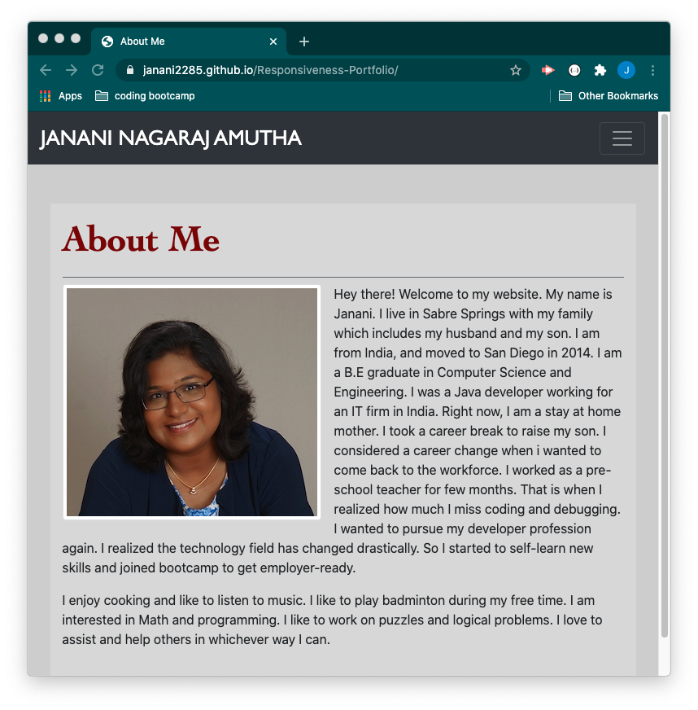
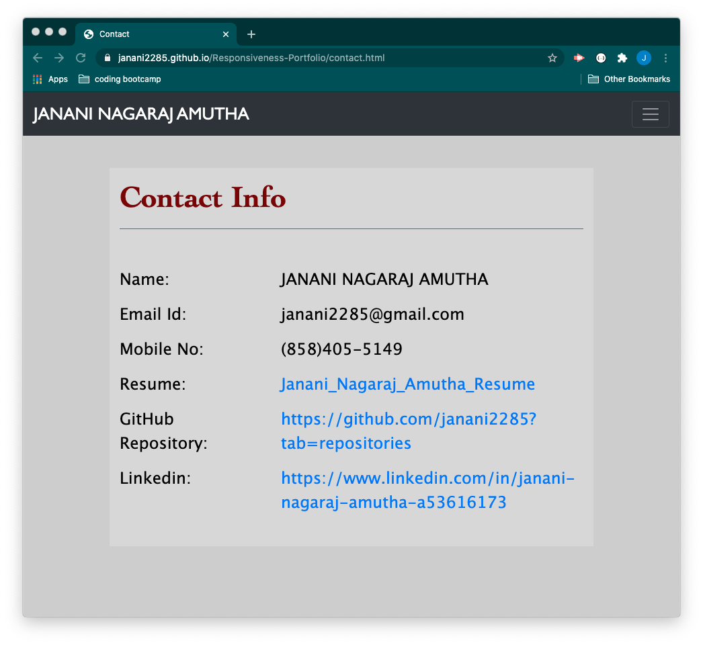
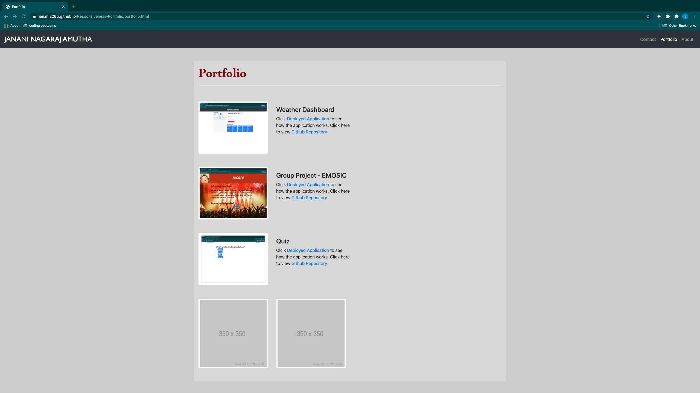

# RESPONSIVE PORTFOLIO

## Description 

This repository consists of code that creates web pages of a person's (JANANI NAGARAJ AMUTHA) professional needs. There is a about page that displays bio-data of the person, a contact page to display contact details, social meadia links and github reposotory and a portfolio page to display the main projects the person has worked on.

These pages are created using HTML. Bootstrap 4 is used to include nav bar and responsive behaivior (to display in various devices or screen size). Custom CSS is added to enhance styling.

Git is used for version controling and for perioding commits to Gitlab.

## Deployed Application URL

https://janani2285.github.io/Responsiveness-Portfolio/

## Screenshots of the application

